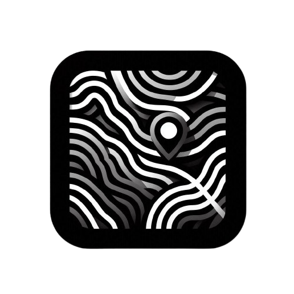
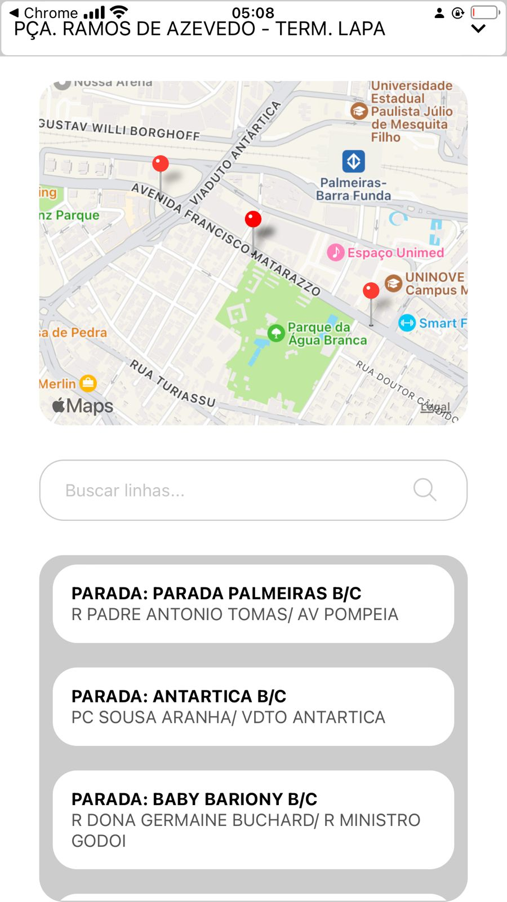
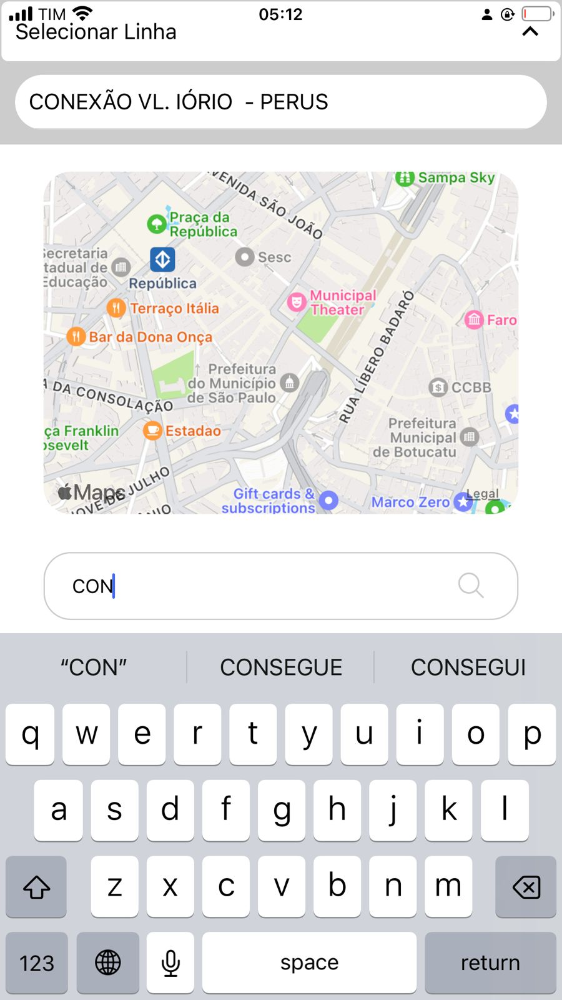

# SP Transportes

## Introduction

The **SP Transportes** project is a mobile application developed with **React Native** that aims to improve the visibility and accessibility of public transport for users in downtown São Paulo. Through the integration with **SPTrans' Olho Vivo API**, the app displays real-time bus lines, allowing users to search, view, and track the status of bus routes directly on an interactive Google Map.

  
  
  

Additionally, to enhance user interaction, other APIs were incorporated, such as the **Google Maps API** and geolocation features for an improved navigation experience.

  
  
  

## Key Features

- Real-time display of bus routes based on the Olho Vivo API.
- Integration with Google Maps for a geographical view of bus routes.
- Search bar to easily find bus lines.
- User geolocation to display their position on the map.
- Implementation of Google login via **Google Sign-In**.
- Comprehensive documentation of the entire app development process.

## Tools and Technologies Used

- **React Native**: The main framework used for mobile development.
- **Expo**: Facilitates app development and builds.
- **Olho Vivo API**: SPTrans' API for real-time bus data.
- **Google Maps API**: Used to display maps and public transport routes.
- **Axios**: Library used for HTTP requests.
- **React Native Geolocation**: To obtain the user's real-time location.
- **React Native Google Sign-In**: To implement Google login functionality.

  
  &nbsp;&nbsp;&nbsp;&nbsp;
  

## App Design

The app's design was created in Figma, following a minimalist and intuitive layout to make it easy to use, whether the user is familiar with technology or has little experience. The main screens include:

1. **Prototype**: Initial draft of the app's functionalities.
2. **Menu**: Initial screen with navigation options.
3. **Bus Line Selection**: Displays available bus line options.
4. **Selected Bus Line Display**: Shows the selected bus line on the map.
5. **Search State**: Allows users to search for a specific bus line.

All images related to the app prototype and its states are stored in the \`public\` folder, named \`image-1.jpeg\` to \`image-5.jpeg\`.

  
  &nbsp;&nbsp;&nbsp;&nbsp;
  &nbsp;&nbsp;&nbsp;&nbsp;
  

## References

- [Expo Documentation](https://docs.expo.dev/)
- [Axios Documentation](https://axios-http.com/ptbr/docs/intro)
- [React Native Dotenv](https://www.npmjs.com/package/react-native-dotenv)
- [Expo MapView SDK](https://docs.expo.dev/versions/latest/sdk/map-view/)
- [React Native Geolocation](https://github.com/michalchudziak/react-native-geolocation)
- [React Native Google Sign-In](https://github.com/react-native-google-signin/google-signin)
- [Expo Location SDK](https://docs.expo.dev/versions/latest/sdk/location/)

## Contact

For more information about the project or collaboration inquiries, feel free to reach out:

- **Email**: vsandre40@gmail.com
