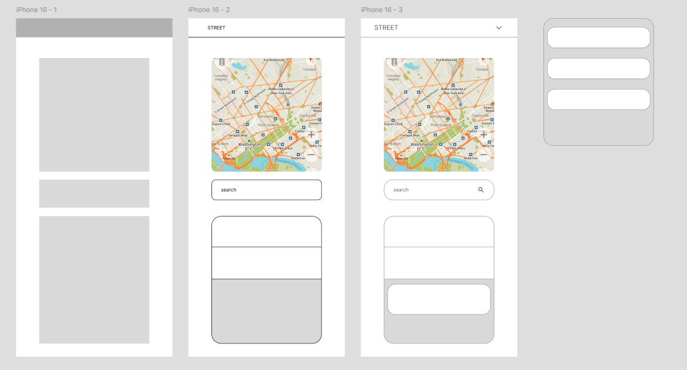
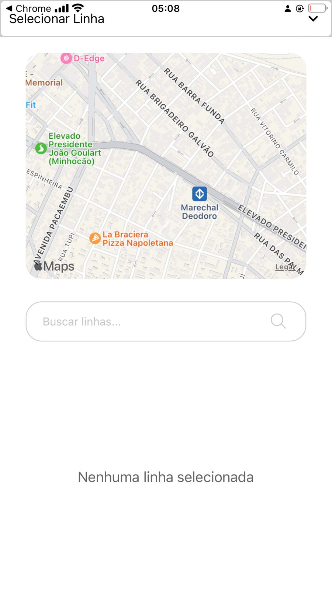
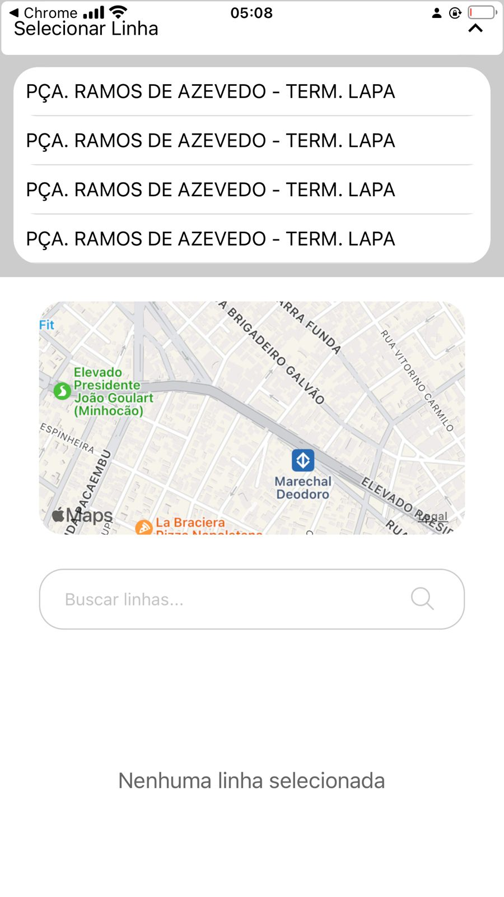

# SP Transportes

## Introduction

O projeto "SP Transportes" é uma aplicação mobile desenvolvida com **React Native** que visa melhorar a visibilidade e acessibilidade dos usuários ao transporte público na região central de São Paulo. Através da integração com a **API Olho Vivo** da SPTrans, o aplicativo exibe as linhas de ônibus em tempo real, permitindo que os usuários pesquisem, visualizem e acompanhem o status das linhas diretamente no mapa interativo do Google Maps.

  

Além disso, para facilitar a interação do usuário, foram incorporadas outras APIs, como o **Google Maps API** e funcionalidades de geolocalização para uma experiência de navegação aprimorada.

  

## Funcionalidades Principais

- Exibição de linhas de ônibus em tempo real com base na API Olho Vivo.
- Integração com o Google Maps para uma visualização geográfica das linhas de ônibus.
- Barra de pesquisa para facilitar a busca de linhas.
- Geolocalização do usuário para indicar sua posição no mapa.
- Implementação de login com Google utilizando o **Google Sign-In**.
- Documentação detalhada de todo o desenvolvimento do app.

## Ferramentas e Tecnologias Utilizadas

- **React Native**: Framework principal para o desenvolvimento mobile.
- **Expo**: Utilizado para facilitar o desenvolvimento e a construção do projeto.
- **Olho Vivo API**: API da SPTrans para obtenção de dados em tempo real sobre as linhas de ônibus.
- **Google Maps API**: Para exibir os mapas e as rotas de transporte público.
- **Axios**: Biblioteca para fazer as requisições HTTP.
- **React Native Geolocation**: Para obter a localização do usuário em tempo real.
- **React Native Google Sign-In**: Para implementar o login via Google.

  

## Design do App

O design do aplicativo foi feito no Figma, seguindo um layout minimalista e intuitivo para facilitar o uso, tanto para quem está acostumado com a tecnologia quanto para quem tem pouca experiência. As principais telas são:

1. **Protótipo**: Esboço inicial das funcionalidades.
2. **Menu**: Tela inicial com opções de navegação.
3. **Seleção de Linha**: Exibe as opções de linhas disponíveis.
4. **Exibição da Linha Selecionada**: Mostra a linha de ônibus escolhida no mapa.
5. **Estado de Pesquisa**: Permite que o usuário busque por uma linha específica.

Todas as imagens relacionadas ao protótipo e aos estados do aplicativo estão armazenadas na pasta \`public\`, com o nome de \`image-1.jpeg\` até \`image-5.jpeg\`.

  

## Estrutura de Código

### [Arquivo Principal].tsx

\`\`\`tsx
[COLE O CÓDIGO AQUI]
\`\`\`

### [Arquivo de Configuração de Rotas].tsx

\`\`\`tsx
[COLE O CÓDIGO AQUI]
\`\`\`

### [Componente de Mapa].tsx

\`\`\`tsx
[COLE O CÓDIGO AQUI]
\`\`\`

### [Função de Requisição API com Axios]

\`\`\`tsx
[COLE O CÓDIGO AQUI]
\`\`\`

## Referências

- [Expo Documentation](https://docs.expo.dev/)
- [Axios Documentation](https://axios-http.com/ptbr/docs/intro)
- [React Native Dotenv](https://www.npmjs.com/package/react-native-dotenv)
- [Expo MapView SDK](https://docs.expo.dev/versions/latest/sdk/map-view/)
- [React Native Geolocation](https://github.com/michalchudziak/react-native-geolocation)
- [React Native Google Sign-In](https://github.com/react-native-google-signin/google-signin)
- [Expo Location SDK](https://docs.expo.dev/versions/latest/sdk/location/)

## Contato

Para mais informações sobre o projeto ou colaborações, entre em contato:

- **Email**: [SEU EMAIL AQUI]
